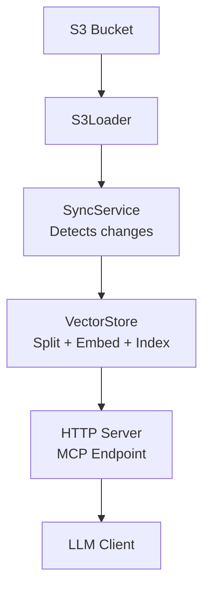

# S3 Documentation MCP Server

[](https://github.com/yoanbernabeu/S3-Documentation-MCP-Server/actions/workflows/ci.yml)
[](https://github.com/yoanbernabeu/S3-Documentation-MCP-Server/actions/workflows/docker-build.yml)

Give your LLM semantic search capabilities over Markdown documentation stored on S3, with **100% local embeddings** (no API costs).

> [!IMPORTANT]  
> 🚧 This project is a work in progress.
> APIs and behavior may change at any time, and backward compatibility is not ensured.
> Not suitable for production.

## Quick Start

### With Docker (Recommended)

```bash
# 1. Prerequisites
# You need Ollama running on your machine
ollama pull nomic-embed-text

# 2. Install
npm install
cp env.example .env  # Configure your S3 credentials

# 3. Run
docker run -d \
  --name s3-doc-mcp \
  -p 3000:3000 \
  --env-file .env \
  -v $(pwd)/data:/app/data \
  yoanbernabeu/s3-doc-mcp:latest
```

Or use Docker Compose (Local Build):
```bash
docker compose up -d
```

### From Source

```bash
# 1. Prerequisites
# You need Ollama running on your machine
ollama pull nomic-embed-text

# 2. Install & Run
npm install
cp env.example .env  # Configure your S3 credentials
npm run build && npm start

# 3. For local development
npm run dev
```

Your MCP server is now running on `http://localhost:3000`

## Features

- 🔌 **Universal S3**: AWS S3, MinIO, Scaleway, DigitalOcean Spaces, Cloudflare R2, Wasabi...
- 🧠 **Local RAG**: Ollama embeddings (nomic-embed-text) - no API costs
- 🔄 **Smart Sync**: Incremental updates via ETag comparison
- ⚡ **Fast Search**: HNSWLib vector index with cosine similarity
- 🛠️ **2 MCP Tools**: `search_documentation` and `refresh_index`

## How It Works



1. **S3Loader**: Scans `.md` files, downloads content, tracks ETags
2. **SyncService**: Detects new/modified/deleted files, syncs incrementally
3. **VectorStore**: Chunks text (1000 chars), generates embeddings (Ollama), indexes with HNSWLib
4. **MCP Server**: Exposes `search_documentation` and `refresh_index` tools via HTTP

## Configuration

Copy `env.example` to `.env` and configure your S3 credentials and preferences:

```bash
cp env.example .env
```

See [`env.example`](env.example) for all available options and detailed documentation.

## MCP Tools

### `search_documentation`

```json
{
  "query": "How to configure S3?",
  "max_results": 4
}
```

Returns relevant document chunks with similarity scores and sources.

### `refresh_index`

```json
{
  "force": false  // true = full reindex, false = incremental
}
```

Syncs the index with S3. Use `force: true` to rebuild everything.

## Use Cases

- **📚 Product Documentation**: Let Claude/Cursor/etc answer from your docs
- **🏢 Internal Wiki**: AI-powered company knowledge search
- **📖 API Docs**: Help developers find API information
- **🎓 Educational Content**: Build AI tutors with course materials

## 📝 License

MIT

## 👤 Author

Yoan Bernabeu

