# S3 Documentation MCP Server

[](https://github.com/yoanbernabeu/s3-doc-mcp/actions/workflows/ci.yml)
[](https://github.com/yoanbernabeu/s3-doc-mcp/actions/workflows/docker-build.yml)

A **Model Context Protocol (MCP)** server that enables LLMs (Claude, GPT, etc.) to **semantically search** through Markdown documentation stored on S3-compatible services using **local RAG** (Retrieval Augmented Generation).

## 📖 What is this?

This server acts as a **bridge** between your LLM and your S3-stored documentation:

1. **📥 Indexes**: Automatically scans and downloads Markdown files (`.md`) from your S3 bucket
2. **🔪 Chunks**: Splits documents into smaller, semantically meaningful chunks
3. **🧮 Vectorizes**: Generates embeddings using **Ollama** (100% local, no API costs)
4. **💾 Stores**: Saves vectors in an optimized **HNSWLib** index for ultra-fast similarity search
5. **🔍 Searches**: When your LLM needs information, it performs semantic search to find the most relevant passages
6. **🔄 Syncs**: Intelligently detects changes (new, modified, or deleted files) and updates the index accordingly

```mermaid
graph TB
    S3["📦 S3 Bucket<br/>(Markdown Documentation)"]
    Server["🖥️ S3 Doc MCP Server<br/>• Chunks docs<br/>• Vectorizes<br/>• Stores locally"]
    LLM["🤖 LLM (Claude/GPT)<br/>search_documentation('How to...?')<br/>↓<br/>Gets relevant context"]
    
    S3 -->|"1. Scan & Sync"| Server
    Server -->|"2. MCP Tools"| LLM
    
    style S3 fill:#e1f5ff
    style Server fill:#fff3e0
    style LLM fill:#f3e5f5
```



## 🎯 Key Features

### 🔌 Universal S3 Compatibility
- **AWS S3**: Native support
- **MinIO**: Self-hosted, on-premise
- **Scaleway Object Storage**: European cloud provider
- **DigitalOcean Spaces**: Simple cloud storage
- **Cloudflare R2**: Zero egress fees
- **Wasabi**: Hot cloud storage
- **Any S3-compatible API**: Custom endpoints supported

### 🧠 Local RAG with Zero API Costs
- **Local embeddings** via Ollama (`nomic-embed-text`)
- **No external API calls** for vectorization
- **Private & secure**: Your data never leaves your infrastructure
- **Fast**: HNSWLib provides near-instantaneous similarity search

### 🔄 Intelligent Synchronization
- **Incremental sync**: Only processes changed files (via ETag comparison)
- **Automatic detection**: New, modified, and deleted files
- **Startup sync**: Index updates automatically when server starts
- **Periodic sync**: Optional scheduled re-indexing
- **Manual refresh**: On-demand via MCP tool

### 🛠️ MCP Tools

#### `search_documentation`
Performs semantic search across your indexed documentation.

**Input:**
```json
{
  "query": "How do I configure authentication?",
  "max_results": 4
}
```

**Output:**
- Relevant document chunks
- Source file paths
- Similarity scores
- Formatted context ready for LLM consumption

#### `refresh_index`
Triggers index synchronization with S3.

**Input:**
```json
{
  "force": false  // true = full reindex, false = incremental
}
```

**Output:**
- Sync metrics (documents added/modified/deleted)
- Duration
- Error count

## 💡 Use Cases

- **📚 Technical Documentation**: Make your product docs queryable by AI assistants
- **🏢 Internal Knowledge Base**: Enable AI-powered search across company wikis
- **📖 API Documentation**: Help developers find relevant API information
- **📝 Research Papers**: Search through academic documentation
- **💬 Customer Support**: Build AI assistants that reference your help center
- **🎓 Educational Content**: Create AI tutors with access to course materials

## 🔧 How It Works

### Architecture Overview

```mermaid
graph TD
    S3["📦 S3 Bucket<br/>Markdown Files"]
    
    S3Loader["S3Loader<br/>• Lists .md files<br/>• Downloads content<br/>• Tracks ETags"]
    
    SyncService["SyncService<br/>• Detects changes<br/>• Incremental sync<br/>• Full reindex"]
    
    VectorStore["HNSWVectorStore<br/>1️⃣ Text Splitting (1000 chars/chunk)<br/>2️⃣ Vectorization (Ollama)<br/>3️⃣ Vector Storage (HNSWLib)<br/>4️⃣ Persistence (./data/)"]
    
    HTTPServer["🌐 HTTP Server<br/>Express + MCP<br/>POST /mcp"]
    
    Tools["🛠️ MCP Tools<br/>• search_documentation<br/>• refresh_index"]
    
    LLM["🤖 LLM Client<br/>Claude, GPT, etc.<br/>Semantic Search"]
    
    S3 -->|Load| S3Loader
    S3Loader -->|Documents| SyncService
    SyncService -->|Index| VectorStore
    VectorStore -->|Vectors| HTTPServer
    HTTPServer -->|Expose| Tools
    Tools -->|MCP Protocol| LLM
    
    style S3 fill:#e3f2fd
    style S3Loader fill:#fff3e0
    style SyncService fill:#fff3e0
    style VectorStore fill:#e8f5e9
    style HTTPServer fill:#f3e5f5
    style Tools fill:#f3e5f5
    style LLM fill:#fce4ec
```



### Data Flow

#### 1️⃣ **Indexing Process**

```mermaid
graph LR
    A["📄 Markdown File<br/>(S3)"] --> B["🔪 Split into chunks<br/>RecursiveCharacterTextSplitter"]
    B --> C["🧮 Generate embeddings<br/>Ollama: nomic-embed-text"]
    C --> D["💾 Store vectors<br/>HNSWLib + cosine"]
    D --> E["💽 Save to disk<br/>./data/hnswlib-store/"]
    
    style A fill:#e3f2fd
    style B fill:#fff3e0
    style C fill:#e8f5e9
    style D fill:#f3e5f5
    style E fill:#fce4ec
```



#### 2️⃣ **Search Process**

```mermaid
graph LR
    A["❓ User Query<br/>'How to configure S3?'"] --> B["🧮 Vectorize query<br/>Ollama"]
    B --> C["🔍 Similarity search<br/>HNSWLib"]
    C --> D["🎯 Filter by threshold<br/>score >= 0.5"]
    D --> E["📋 Return top K results<br/>+ sources"]
    
    style A fill:#e3f2fd
    style B fill:#fff3e0
    style C fill:#e8f5e9
    style D fill:#f3e5f5
    style E fill:#fce4ec
```



#### 3️⃣ **Sync Process**

```mermaid
graph LR
    A["📋 List S3 files<br/>(.md only)"] --> B["⚖️ Compare with<br/>.sync-state.json"]
    B --> C["🔍 Detect changes<br/>New | Modified | Deleted"]
    C --> D["⚡ Apply changes<br/>to vector store"]
    D --> E["💾 Save state<br/>+ vector index"]
    
    style A fill:#e3f2fd
    style B fill:#fff3e0
    style C fill:#e8f5e9
    style D fill:#f3e5f5
    style E fill:#fce4ec
```



### Technical Stack

- **MCP SDK**: `@modelcontextprotocol/sdk` - Model Context Protocol implementation
- **S3 Client**: `@aws-sdk/client-s3` - Universal S3 access
- **Vector Store**: `hnswlib-node` - Fast approximate nearest neighbor search
- **Embeddings**: `@langchain/community` with Ollama integration
- **Text Processing**: `@langchain/textsplitters` - Semantic chunking
- **Server**: Express.js with MCP HTTP transport

### Storage Structure

```
./data/
  ├── hnswlib-store/
  │   ├── hnswlib.index       # Vector index (binary)
  │   ├── docstore.json        # Document metadata
  │   └── args.json            # HNSWLib configuration
  │
  └── .sync-state.json         # Sync state tracking
      {
        "lastSyncDate": "2025-01-11T...",
        "documents": {
          "docs/intro.md": {
            "etag": "abc123...",
            "chunkCount": 5,
            "status": "indexed"
          }
        }
      }
```

## 📋 Prerequisites

- **Node.js** >= 18.0.0
- **Ollama** installed and running
  ```bash
  brew install ollama  # macOS
  ollama serve
  ollama pull nomic-embed-text
  ```
- **S3 (or compatible)**: Read access to bucket
  - ✅ AWS S3
  - ✅ MinIO (self-hosted)
  - ✅ Scaleway Object Storage
  - ✅ DigitalOcean Spaces
  - ✅ Cloudflare R2
  - ✅ Wasabi
  - ✅ Any other S3-compatible provider

## 🚀 Installation

```bash
# Install dependencies
npm install

# Copy and configure environment variables
cp env.example .env
# Edit .env with your AWS credentials and configuration

# Build
npm run build
```

## 🔧 Configuration

See `env.example` for all available environment variables.

## 📦 Usage

### Development

```bash
npm run dev
```

### Production

```bash
npm run build
npm start
```

### 🐳 Docker

#### Build and Run

```bash
# Copy and configure environment variables
cp env.example .env
# Edit .env with your configuration

# Build and start with Docker Compose
docker compose up -d

# View logs
docker compose logs -f

# Stop
docker compose down
```

#### Configuration

The Docker setup expects:
- **Ollama** running externally on the host machine at `http://host.docker.internal:11434`
- **S3** (or compatible) service accessible from the container

**Note**: The Ollama URL is hardcoded to `http://host.docker.internal:11434` in the `compose.yaml` file. If your Ollama instance runs on a different host or port, you'll need to modify the `OLLAMA_BASE_URL` value directly in the `compose.yaml` file.

#### Volumes

The vector store data is persisted in a Docker volume named `vector-store-data` to avoid re-indexing on container restart.

## 📝 License

MIT

## 👤 Author

Yoan Bernabeu

